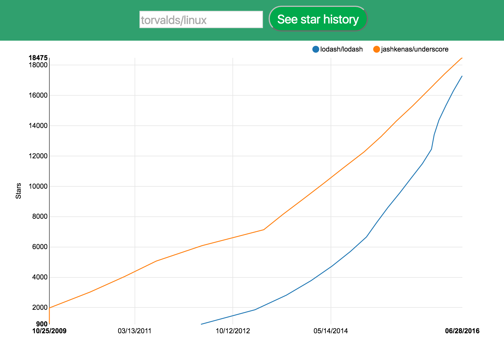

> As a chrome extension: https://github.com/timqian/star-history-plugin/ 

## [Show cases: lodash vs underscore](http://www.timqian.com/star-history/#lodash/lodash&jashkenas/underscore)

## Updates

- 2016-6-30: Alert to notie

- 2016-6-28: Add clear btn

- 2016-6-28: Better view for "many star" repos (use current star number as the last point on the graph)

- 2016-6-26: **Store repo info into url hash**

- 2016-6-26: **multiple kinds of input styles (eg: github.com/timqian/star-history, ...)**

- 2016-6-26: Better view for less star repos #28

- 2016-6-14: **Toggle search by hit enter** #26, prevent crash while searching for not existing repo

- 2016-5-26: Update mobile view

> [Donate with bitcoin][https://getcryptoo.github.io/]
